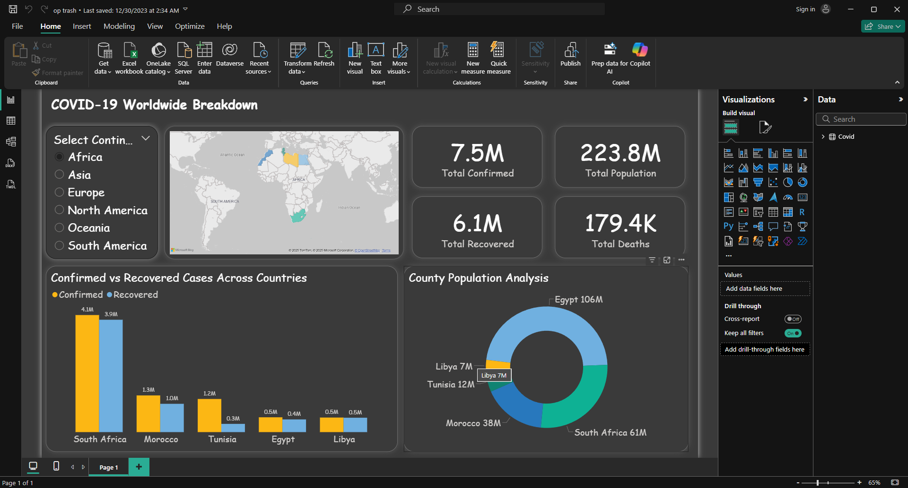

# COVID-19 Global Cases Analysis

This Power BI project analyzes global COVID-19 data, focusing on confirmed and recovered cases across continents.  
The dashboard provides insights into trends, distribution, and regional comparisons.

---

## Dashboard Highlights
- Confirmed vs. recovered cases by continent.
- Visualized data using map and pie chart for global comparison.
- Interactive analysis of regional trends.

---

## Files in Repository
- `COVID Report.pbix` → Power BI report file.  
- `COVID.txt` → Source dataset used.  
- `covid.png` → Dashboard screenshot.

---

## How to Use
1. Download the `.pbix` file.  
2. Open it in **Power BI Desktop**.  
3. Explore the visuals interactively.

---

## Skills Demonstrated
- Data cleaning and modeling  
- Creating interactive map and pie chart visuals  
- Data storytelling & global trend analysis

---

## Dashboard Screenshot

---

Created as part of a professional **data analysis portfolio** showcasing Power BI skills.
